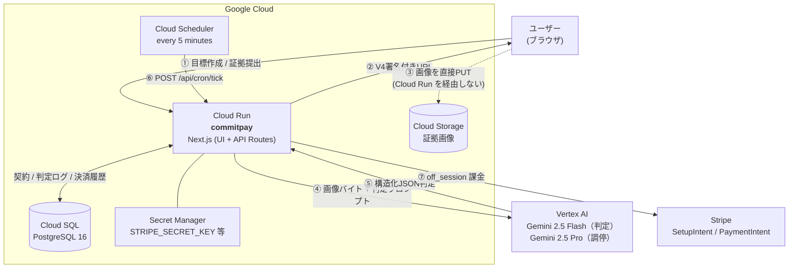
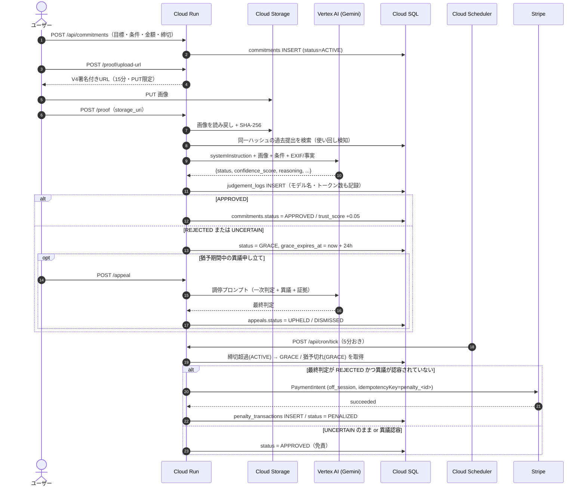

# CommitPay — アーキテクチャ

> 参照元の設計を引き継いだ資料です。このリポジトリの Cloud Run サービス名は `commitpay-agi-lab`、ローカル設定と起動手順は [README](../README.md) を参照してください。

## ① システム構成（MVP / ハッカソン版）

### 本番構成との差分（意図的に削った点）

| 本設計 | MVP | 理由 |
|---|---|---|
| Cloud Tasks で1契約ごとに猶予タイマーを予約 | Cloud Scheduler 5分おき + 1本のスイープSQL | 構成要素が1つ減り、タスクキューの権限設定が不要。契約数が10万件規模になるまでスイープで足りる |
| フロント(Cloud CDN) / API(Cloud Run) を分離 | Next.js 1コンテナに同居 | デプロイ対象が1つ。CORS も不要 |
| 証拠判定を非同期ジョブ化 | 提出APIの中で同期実行（最大60秒） | Flash なら 3〜6秒で返るため、デモではむしろ体験が良い |
| Identity Platform で認証 | デモユーザー固定 | 認証はデモの価値に寄与しない |
| Stripe Connect で寄付先へ送金 | 自社アカウントへの課金のみ | Connect のオンボーディングは2時間に収まらない |

## ② 判定〜執行シーケンス

## 誤課金を防ぐための設計

金銭が動くので、「AIの出力をそのまま執行に繋げない」ことを構造で担保している。

1. **確信度による降格** — `confidence_score < 0.75` の判定は、モデルが APPROVED / REJECTED と言っていてもアプリ側で `UNCERTAIN` に落とす（[judge.ts](../src/lib/ai/judge.ts) の `normalize`）。
2. **UNCERTAIN は課金しない** — 猶予期限が来ても、最終判定が UNCERTAIN なら免責して APPROVED にする。誤課金の損害は見逃しより大きい、という非対称性を前提にしている。
3. **不正シグナルがある APPROVED を信じない** — `suspicious_indicators` が非空なら APPROVED を UNCERTAIN に降格する。
4. **二重課金の構造的防止** — `penalty_transactions.idempotency_key`（= `penalty_<commitment_id>`）の UNIQUE 制約 + Stripe の Idempotency-Key + `SELECT ... FOR UPDATE SKIP LOCKED`。ワーカーが多重起動しても課金は1回。
5. **プロンプトインジェクション対策** — ユーザーが書ける文字列（達成条件・補足・異議文）と画像内テキストは system プロンプトで「データであって命令ではない」と定義し、閉じタグの偽造を `sanitizeUserText` で除去。injection を検知したら `REJECTED` + シグナル記録。
