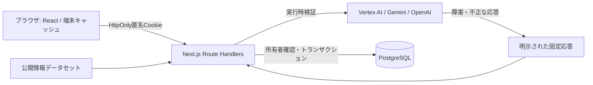

# 現在のAIおかんの設計

本書は `ai-okan/` の実装を対象とします。旧CommitPayの設計は [ARCHITECTURE.md](ARCHITECTURE.md) に残っています。

## 状態と所有者

ランダムな匿名セッションIDをHttpOnly Cookieに保持し、セッションごとにDBのユーザーを分離します。これはログインではありません。同じブラウザプロファイルを共有する人は同じセッションを使い、Cookieを消した場合や別端末では引き継ぎません。旧固定デモユーザーのデータは新しいセッションへ移しません。

サーバーの状態を正とします。DBが読めない場合のみ端末キャッシュを使います。サーバーに状態がないという正常応答は、古いキャッシュを復活させる理由にしません。リセットに失敗した場合も成功とは表示しません。

## 入力とAI

人物の見立てには `data/usutaku.json` の公開情報と任意の補足を使います。個人のメール・SNSアーカイブをアップロードする仕組みは含みません。AIへの入力は命令ではなくデータとして扱うようプロンプトで指示しますが、これだけでプロンプトインジェクションを完全に防ぐとは考えません。

AIが返すプロフィール、発言、判定は構造・文字数・列挙値・数値範囲を検証します。失敗時は固定応答に切り替え、`engine: demo` を返します。ネットワーク呼び出しにはタイムアウトとキャンセルを設定します。

## 証拠と競合

APIは入力サイズ・メディア形式を検証します。保存済みIDがある証拠提出はDBの目標・達成条件を使い、所有者と状態を確認します。保存時にも対象をロックし、判定中に取り消された約束や完了済みの約束を上書きしません。

写真・動画の本体はAIへの解析入力として送りますが、アプリのDBに保存しません。DBにはハッシュ、種類、判定ログ、約束と復元用状態を保存します。AIサービス側の処理・保持条件は利用するプロバイダーと契約設定によります。

## 決済と公開運用の境界

現在の画面の罰金処理は `MOCKED` の記録のみです。旧バックエンドのStripe処理と混同しないでください。本格公開に向けては、認証・アカウント復旧、利用量制限、保存期間と削除、AI費用の管理、実課金時の判定・異議申し立て・送金先検証を別途設計する必要があります。

## 配置

- `ai-okan/app/`: 画面とAPI
- `ai-okan/components/`: UI
- `ai-okan/lib/backend/`: セッション、DB、入力の境界
- `ai-okan/lib/ai-validation.ts`: AI出力の検証
- `ai-okan/tests/`: 単体・回帰テスト
- `ai-okan/e2e/`: 実API・DBを通るブラウザテスト
- `db/schema.sql`: 共有スキーマ
- `.github/workflows/ci-cd.yml`: 検証とデプロイ
